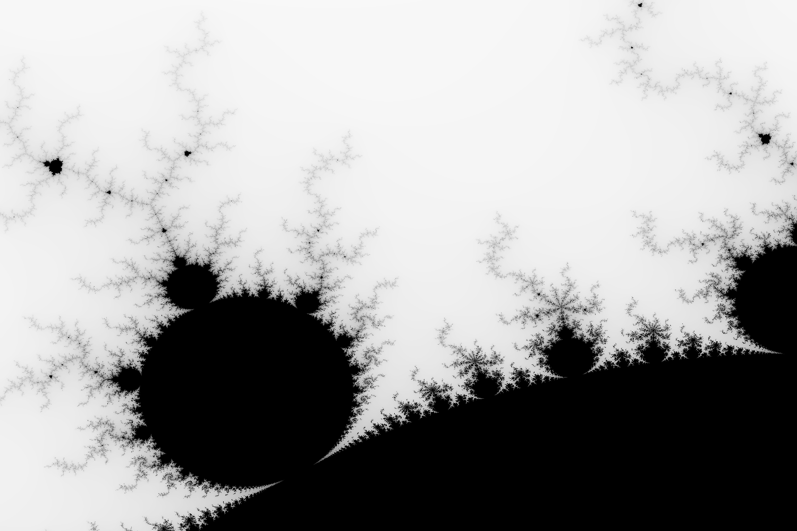

### Mandelbrot Image Generator

Mandelbrot image genrator from the cuncurrency section of Chaper 2 of [Programming Rust](http://shop.oreilly.com/product/0636920040385.do)

Makes images like this



To run, type the following into you terminal

```console
foo@bar:~$ cargo run -- test.png 1500x1000 -1.20,0.35 -1.0,0.10
```
